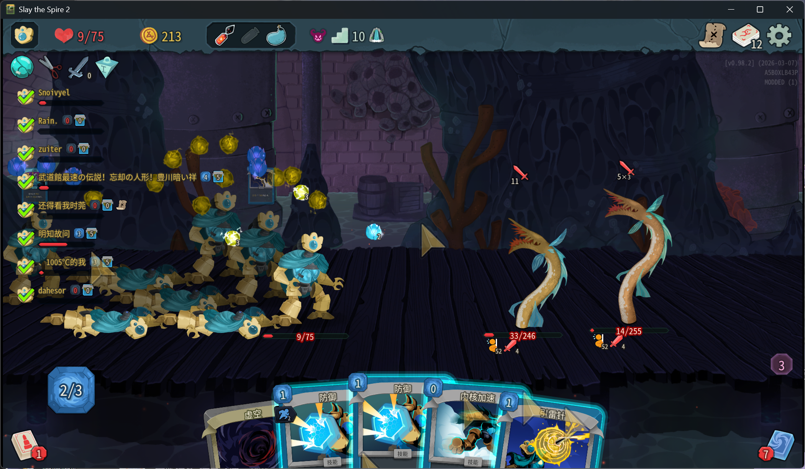

<div align="center">

# Remove Multiplayer Player Limit Reforge

[**简体中文**](README_ZH.md) | [**Changelog**](Changelog.md)


*A Harmony-free Slay the Spire 2 mod that raises the vanilla 4-player multiplayer lobby limit to 16 players.*

</div>

This Reforge build replaces the old Harmony patch set with a reflection and Godot SceneTree based implementation. It keeps the original goal of RMP: larger multiplayer lobbies, cleaner large-party layouts, and optional difficulty scaling for groups beyond the vanilla 4-player cap.

`0.1.8` is the current stable Reforge release. It has been compatibility-checked with Slay the Spire 2 `v0.107.1`, `public-beta v0.108.0`, and `public-beta v0.109.0`. These game versions use the same RMP source and network protocol; no beta-only RMP build is required.

Compatibility and fixes included in `0.1.8`:

- Fixed the `v0.109.0` regression where 5+ player lobbies could remain stuck after everyone readied and then start immediately when one player left. RMP now continuously maintains its ready/unready button handlers, removing vanilla callbacks even when the game's screen initialization reconnects them after the first patch attempt.
- Isolated extended-lobby maintenance tasks so a failure while replacing the host join handler or patching one lobby screen cannot prevent the other ready/start protections from running.
- Adapted the settings focus-chain reflection call to both the older 2-parameter and `v0.109.0` 3-parameter game signatures.
- Verified against `v0.108.0`: the mod compiles against the current game assemblies, passes its reflection-contract checks, initializes all RMP modules, and reaches the main menu without RMP load errors.
- Retains `v0.107.1` compatibility by avoiding new version-specific game calls and keeping the same extended lobby wire format.
- Preserves the host's player order when applying extended lobby snapshots, then dispatches player connection, disconnection, and state-change notifications against the completed ordered list.
- Fixed the `beta 0.106.1` mod-load failure caused by the updated `INetMessage.ShouldBuffer` interface requirement.
- Fixed the first-treasure-room desync reported on `beta 0.106` by removing RMP's duplicate remote chest reward replay and leaving the game's one-off chest synchronization in control.
- Fixed 5-16 player lobby flow by routing unsafe joins, ready state, and begin-run synchronization through the RMP extended lobby protocol.
- Uses 4-bit slot IDs for player slots `0-15` and 5-bit list lengths for up to 16 lobby entries.

<br>

<div align="center">
  
  <br><br>
  
  <br><br>
  
  <br><br>
  
</div>

<br>

## ✨ Core Features

* 👥 **Expanded Multiplayer:** Raises the multiplayer lobby cap from 4 to 16 players. In `0.1.8`, the cap is fixed at 16 for every hosted lobby.
* 🏕️ **Expanded Campfire Seating:** When there are more than 4 players, character models are arranged into additional rows instead of overlapping.
* 💰 **Organized Shop Layout:** Large groups are arranged into a cleaner shop grid to reduce crowding and model overlap.
* 🎁 **Smart Treasure Room:** Relic reward choices scale and reflow for larger groups, while treasure reward synchronization is left to the game's one-off synchronizer.
* 📝 **Game Settings Entry:** Adds a Difficulty Scaling control under the game's settings screen. The old max-player paginator has been removed because the current build always hosts 16-player lobbies.
* ⚔️ **Difficulty Scaling:** When enabled, monster HP, block, and power values continue scaling beyond the vanilla 4-player cap.
* 🌐 **RMP Extended Lobby Protocol:** Adds a mod-network protocol for large-lobby snapshots, ready state, and begin-run flow without relying on unsafe vanilla lobby messages.
* 🍎 **macOS TLS Workaround:** Provides a `config.ini` toggle for macOS multiplayer certificate issues such as `unknown ca` / `BadCert`.
* 🚫 **No Harmony / MonoMod:** No `[HarmonyPatch]`, transpilers, or runtime method replacement. Reforge uses the official mod entry point plus reflection and injected Godot nodes.

## 🎮 Installation

### Windows

1. Download `sts2-RMP-0.1.8.zip` from the release package.
2. Extract the archive.
3. Copy the inner `RemoveMultiplayerPlayerLimit` folder to:

   ```text
   <Slay the Spire 2>/mods/
   ```

4. Launch the game. The mod will be loaded by the game mod loader.

### macOS (Apple Silicon)

macOS builds may require placing the mod inside the `.app` bundle and running the game under Rosetta 2.

> **Note:** Some macOS players hit `unknown ca` / `BadCert` errors when joining multiplayer. Reforge includes a macOS-only TLS compatibility workaround. If you need the original certificate behavior, edit `config.ini` and set `tls_workaround=false`.

1. Download `sts2-RMP-0.1.8.zip` from the release package.
2. Extract the archive and copy the inner `RemoveMultiplayerPlayerLimit` folder to:

   ```text
   <Slay the Spire 2>/SlayTheSpire2.app/Contents/MacOS/mods/
   ```

3. If launching directly causes **"Steam failed to initialize"**, keep the Steam client running in the background and create `steam_appid.txt` next to the game executable:

   ```bash
   echo "2868840" > "$HOME/Library/Application Support/Steam/steamapps/common/Slay the Spire 2/SlayTheSpire2.app/Contents/MacOS/steam_appid.txt"
   ```

4. Run the game under Rosetta 2 using one of these methods:

   **Option A - Finder:** Find `SlayTheSpire2.app`, right-click > **Get Info**, enable **"Open using Rosetta"**, then launch the app directly.

   **Option B - Terminal:**

   ```bash
   cd "$HOME/Library/Application Support/Steam/steamapps/common/Slay the Spire 2/SlayTheSpire2.app/Contents/MacOS"
   arch -x86_64 "./Slay the Spire 2"
   ```

### Linux

Linux uses the same mod folder layout as Windows:

```text
<Slay the Spire 2>/mods/
```

Start the game normally from Steam or your local executable.

> **Compatibility note:** `0.1.8` has been checked with game versions `v0.107.1`, `public-beta v0.108.0`, and `public-beta v0.109.0`. All players in a lobby should use the same RMP build. Lobby capacity is fixed at 16; local config only controls difficulty scaling and the macOS TLS workaround.

## ⚙️ Configuration

Runtime settings are saved to:

```text
mods/RemoveMultiplayerPlayerLimit/config.ini
```

Current configurable values:

* `tls_workaround`: macOS TLS compatibility workaround. This is only useful on macOS.
* `difficulty_scaling`: whether monster stats keep scaling beyond 4 players.

Example:

```ini
[macos]
tls_workaround=true

[multiplayer]
difficulty_scaling=true
```

`max_player_limit` from older configs is intentionally ignored in this Reforge release. The current lobby cap is fixed at 16.

> **Important for upgrading from older releases:** If you still have `mods/RemoveMultiplayerPlayerLimit/config.json` from an old build, delete it before launching Reforge. Slay the Spire 2 scans JSON files in the mod folder as manifests, while `config.ini` is safe.

## 🛠️ Building

Requirements:

* .NET 9 SDK
* Godot 4.5.1 for PCK packaging
* Slay the Spire 2 `sts2.dll` and `Steamworks.NET.dll`

Build the DLL:

```bash
dotnet build -c Release
```

Build a full release package:

```powershell
pwsh tools/build_release.ps1 -Configuration Release
```

For beta game branches, build against the installed game's current `sts2.dll`:

```powershell
pwsh tools/build_release.ps1 -Configuration Release -Sts2AssemblyPath "<Slay the Spire 2>/data_sts2_windows_x86_64/sts2.dll"
```

The release script also tries to find the installed game assembly automatically. This matters because game beta updates can change mod-facing interfaces such as `INetMessage`.

## Contributors

Special thanks to the following contributors:

<div align="center">
   <a href="https://github.com/Guchen1">
      
   </a>
   <a href="https://github.com/Lemon2ee">
      
   </a>
   <a href="https://github.com/DawningW">
      
   </a>
   <a href="https://github.com/VariianWrynn">
      
   </a>
</div>
