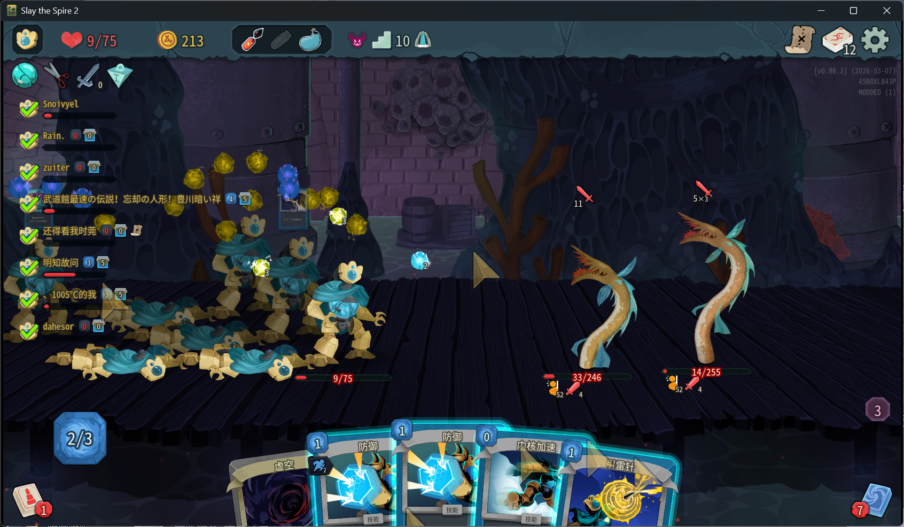

<div align="center">

# 杀戮尖塔2 联机上限解锁 (Remove Multiplayer Player Limit)

[**English**](README.md) | [**更改日志**](Changelog.md)


*一款《杀戮尖塔2》的联机人数上限解锁模组。打破原版 4 人的限制，喊上更多的好友一起爬塔吧！*

</div>

本模组突破了《杀戮尖塔2》原版的联机限制。默认提供完美适配的 **8 人**游玩体验，并可通过配置文件最高解锁至 **16 人**。

<br>

<div align="center">
  
  <br><br>
  
  <br><br>
  
  <br><br>
  
</div>

<br>

## ✨ 核心功能

* 👥 **突破人数限制：** 最高支持 16 人同时联机游玩（默认推荐 8 人）。**注意：超过 8 人时可能会出现渲染错误等问题。**
* 🏕️ **营地座位扩容：** 超过 4 人时，角色不会重叠在一起。营地会自动增加额外的前后排座位，并生成对应的“原木”背景，确保每个玩家都有位置。
* 💰 **商店阵列排布：** 多人同屏时，商店里的角色模型会自动排列成多行多列，告别拥挤和模型穿模。
* 🎁 **宝箱房自适应布局：** 遗物分配界面会根据当前房间的人数自动缩放，智能拆分为双排并居中对齐，让每个人都能清晰地选择遗物。
* 📝 **自定义房间大小：** 首次运行会自动生成 `config.json` 配置文件，允许你自由设置房间的人数上限（4-16人）。

## 🎮 玩家安装说明

1. 从 **Releases** 页面下载最新的 `sts2-RMP-[version].zip` 压缩包。
2. 解压并将内部的 `RemoveMultiplayerPlayerLimit` 文件夹整体复制到游戏的 `<Slay the Spire 2>/mods/` 目录下。
3. 启动游戏并在 **Mods** 菜单中勾选启用本模组。

## ⚙️ 配置文件说明

首次启用模组并启动游戏后，模组目录下会自动生成 `config.json` 文件（路径：`mods/RemoveMultiplayerPlayerLimit/config.json`）。

```json
{
  "max_player_limit": 8,
  "min_supported": 4,
  "max_supported": 16
}
```